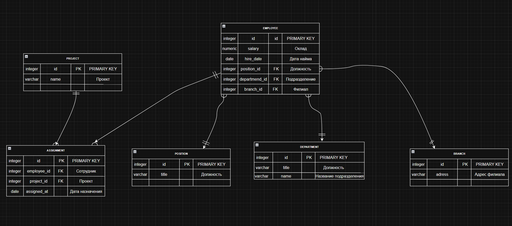

# Домашнее задание к занятию «Базы данных»

---

### Легенда

Заказчик передал вам [файл в формате Excel](https://github.com/netology-code/sdb-homeworks/blob/main/resources/hw-12-1.xlsx), в котором сформирован отчёт. 

На основе этого отчёта нужно выполнить следующие задания.

### Задание 1

Опишите не менее семи таблиц, из которых состоит база данных. Определите:

- какие данные хранятся в этих таблицах,
- какой тип данных у столбцов в этих таблицах, если данные хранятся в PostgreSQL.

Начертите схему полученной модели данных. Можете использовать онлайн-редактор: https://app.diagrams.net/

Этапы реализации:
1.	Внимательно изучите предоставленный вам файл с данными и подумайте, как можно сгруппировать данные по смыслу.
2.	Разбейте исходный файл на несколько таблиц и определите список столбцов в каждой из них. 
3.	Для каждого столбца подберите подходящий тип данных из PostgreSQL. 
4.	Для каждой таблицы определите первичный ключ (PRIMARY KEY).
5.	Определите типы связей между таблицами. 
6.	Начертите схему модели данных.
На схеме должны быть чётко отображены:
   - все таблицы с их названиями,
   - все столбцы  с указанием типов данных,
   - первичные ключи (они должны быть явно выделены),
   - линии, показывающие связи между таблицами.

**Результатом выполнения задания** должен стать скриншот получившейся схемы базы данных.
 
---
### Ответ:

